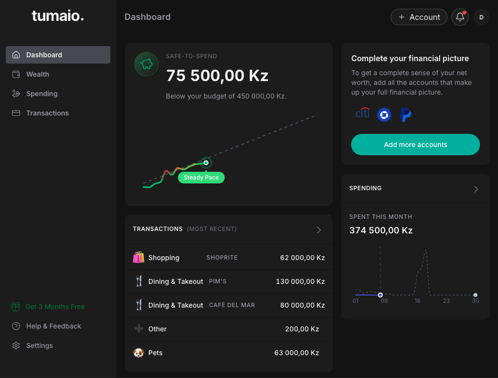
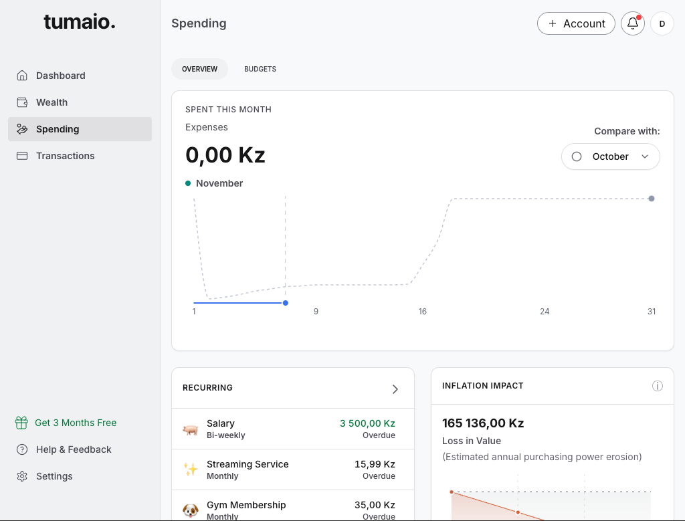
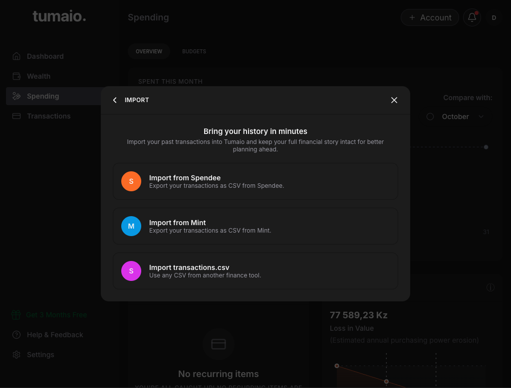
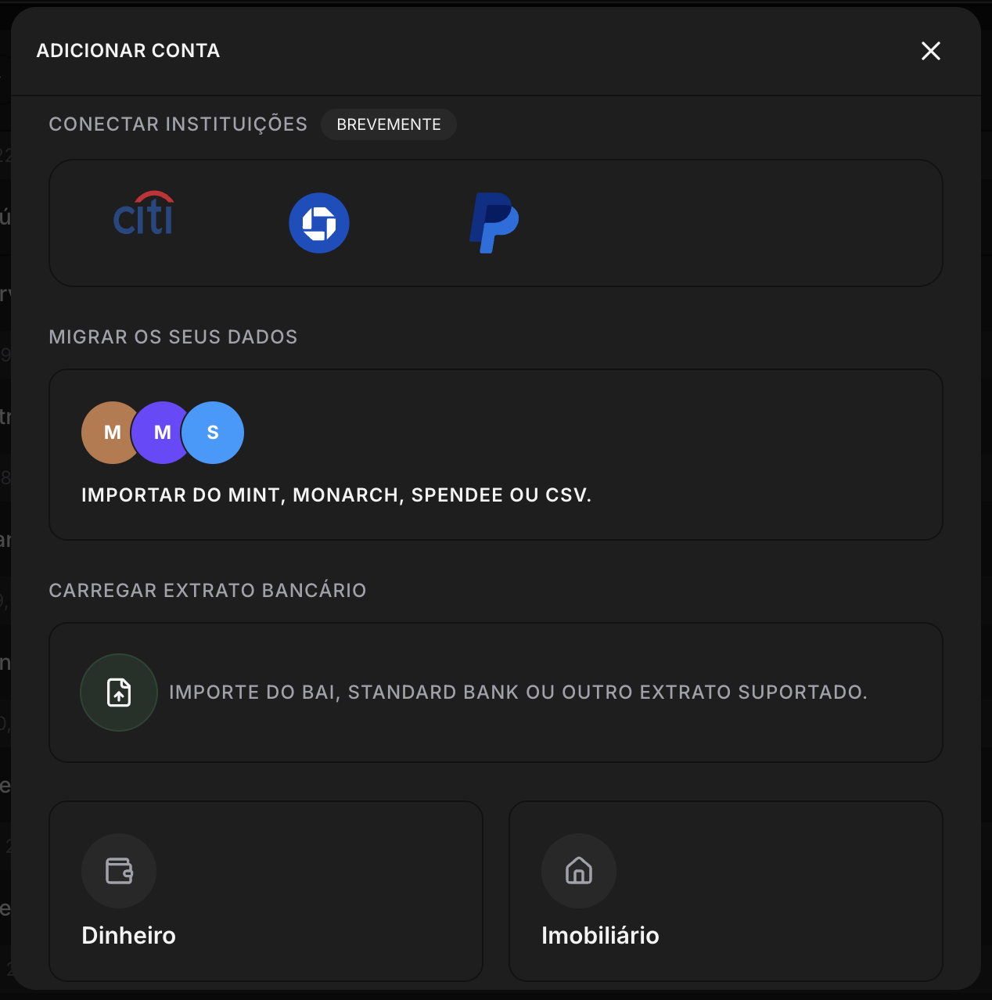
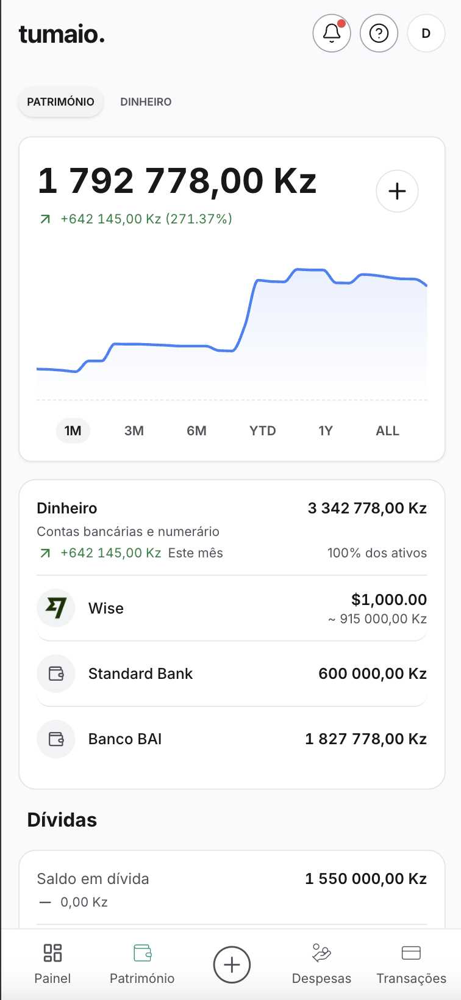
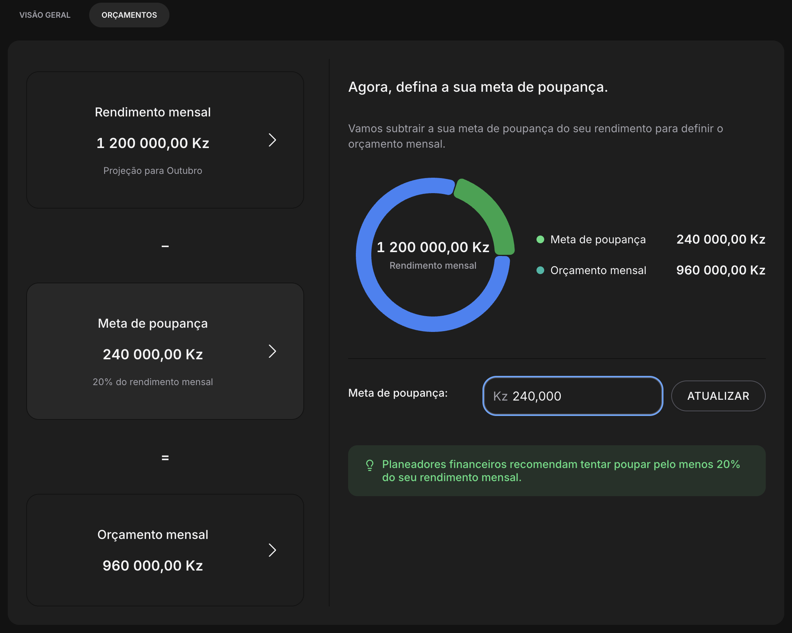

# **Tumaio: An AI-Powered Personal Finance Manager**

-brightgreen>)

---

## **What is Tumaio? (The "Product 101")**

Tumaio is an AI-powered personal finance manager (PFM) built for _everyone_—from a student budgeting for the first time to an expert managing a complex asset portfolio.

It gives you a single, clear, and _complete_ picture of your entire financial life:

> **Track Your Net Worth:** Finally see all your assets (cash, property, car) and liabilities (loans) in one place.  
> **Master Your Budget:** Create flexible, powerful budgets that you can actually stick to.  
> **Get AI-Powered Insights:** Understand your spending habits, get financial forecasts, and identify opportunities to save.  
> **Plan Your Future:** Set and track your goals, from saving for a new car to planning for retirement.

  

  

 
 

> ### **From 0-to-1: The Tumaio MVP in Action**
>
> As a solo founder, I've architected, designed, and built the entire MVP. This gallery is the real, tangible proof of that 0-to-1 process in action.

<table>
<tr>
  <td align="center" style="color: #fafafa90;">
     
    <b style="color: #fafafa;">The 360° Dashboard</b> 
    A high-level command center to see your Net Worth, Cash Flow, and key spending categories at a glance.
  </td>
  <td align="center" style="color: #fafafa90;">
     
    <b style="color: #fafafa;">Spending & Cash Flow Analytics</b> 
    Drill-down charts to track your spending habits, identify opportunities, and see your cash flow over time.
  </td>
  <td align="center" style="color: #fafafa90;">
     
    <b style="color: #fafafa;">Strategic "Competitor Rescue" Tool</b> 
    A custom-built importer to rescue frustrated users from failing apps like Spendee, Monarch, or Mint.
  </td>
</tr>
</table>

 
 

> ### **The Core Financial Ecosystem**
>
> #### These are not just features; they are a complete, interconnected system designed to solve the user's core financial problems, from onboarding to planning.

 

<table>
<tr>
  <td align="center" style="color: #fafafa90;">
     
    <b style="color: #fafafa;">The "Manual-First" Onboarding Hub</b> 
    The "open-door" to your finances. A "manual-first" system built to connect all assets—from cash and property to CSVs and competitor imports.
  </td>
  <td align="center" style="color: #fafafa90;">
     
    <b style="color: #fafafa;">The Unified Net Worth Engine</b> 
    The core of the PFM. A multi-currency engine that tracks all assets (bank accounts, property) and debts to give you a true, real-time Net Worth.
  </td>
  <td align="center" style="color: #fafafa90;">
     
    <b style="color: #fafafa;">The "Inflation-Aware" Planning Tool</b> 
    This is not a simple budget. This is a goals (Metas) and planning (Orçamento) tool built from the ground up for a high-inflation environment.
  </td>
</tr>
</table>

 
 

> ## **The Problem: Why "Generic" PFMs Fail in Emerging Markets**
>
> Generic PFM apps fail in high-inflation, emerging economies due to two critical, unaddressed failures:

 

<ol>
<li>The "US-Centric" Failure: Modern, powerful apps like **Monarch** are built 100% for the US/EU market. They are unusable as they rely on "open banking" APIs that simply do not exist in some emerging markets.</li>
<li>The "Stale Global" Failure: Existing "global" apps like **Spendee** have stagnated. They lack support, have shipped no new features, and—most critically—have **zero inflation awareness**, making their financial advice useless in a high-inflation environment.</li>
</ol>

 
 

---

 
 

## **The "Tumaio" Solution & Go-to-Market Strategy**

Tumaio is architected to solve this from the ground up.

> **The Solution:** An intelligent, "manual-first" platform that gives users the power to track _all_ their assets and get real, inflation-adjusted insights.  
> **The GTM Strategy:** We start with a "beachhead" market: **Angola.** It is a market I know deeply that perfectly represents this problem. After validating and winning here, we will scale to other emerging markets facing the same challenges.

---

 
 

## **Product Roadmap (Phased Rollout)**

- **Phase 1 (MVP):** Perfect the "manual-first" user experience. Give users complete control and prove our value by delivering the market's best budgeting, tracking, and net-worth tools.
- **Phase 2 (AI-Automation):** Use AI to make manual entry obsolete. I am engineering AI-native features like smart receipt scanning and PDF/CSV importers to automate 90% of the work.
- **Phase 3 (Direct Integration):** As the market matures and APIs _do_ become available, we will be in the #1 position to build direct bank integrations.

---

 
 

### **My Role: Solo Architect & 0-to-1 Builder**

As the solo founder, I am responsible for the **entire product lifecycle**:

- **Product Strategy:** Identifying the $1B+ market gap and defining the phased MVP.
- **Systems Architecture:** Designing the complete, scalable, and secure full-stack application.
- **Full-Stack Engineering:** Building the entire platform (API, database, UI) from a blank page.

---

 
 

## **Tech Stack**

| Category         | Technology                    |
| :--------------- | :---------------------------- |
| **Backend**      | Node.js (Fastify), TypeScript |
| **Frontend**     | Next.js, React, TailwindCSS   |
| **Database**     | PostgreSQL, Redis             |
| **AI/ML**        | (e.g., Python, OpenAI API)    |
| **Infra/DevOps** | AWS, Docker, CI/CD            |

---

 
 

## **🔐 Note: This is a "Showcase" Repo**

The core repositories for Tumaio are **private** to protect business IP.

This showcase exists to demonstrate my architectural, product, and engineering skills. My daily progress is reflected in my **daily 800+ contribution streak** on my GitHub profile.
